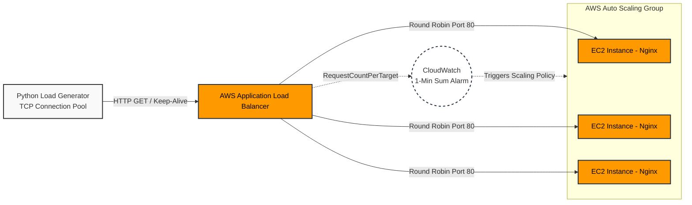

# AWS Auto-Scaling Load Generator



## Overview

A lightweight, purpose-built Python traffic generator designed to stress-test AWS Application Load Balancers (ALBs) and validate CloudWatch-driven Auto Scaling Group (ASG) policies.

Unlike naive looping scripts that exhaust local network resources, this tool utilizes proper TCP connection pooling to ensure sustained, measurable load reaches the AWS target environment to trigger scale-out alarms.

### The engineering challenge: TCP port exhaustion

When initially stress-testing the ALB, basic HTTP request loops proved ineffective. By opening and tearing down a new TCP connection (and full TLS handshake) for every single request, the local machine exhausted its ephemeral port range before generating enough throughput to trigger the AWS scaling thresholds.

This script resolves the client-side bottleneck by using `requests.Session()` and connection pooling.

## Key features

- **Connection pooling (Keep-Alive):** Reuses the underlying TCP connection for multiple requests to the ALB, bypassing local port exhaustion and maximizing throughput.
- **Deterministic RPS:** Configurable Requests Per Second (RPS) to precisely map generated load against CloudWatch Sum metrics.
- **Graceful degradation:** Built-in timeout handling (`timeout=2`) ensures the generator does not hang when the ASG initiates scale-in instance draining or if the ALB drops connections.

## Usage

1. Clone and install dependencies

```bash
pip install requests
```

2. Configure target

Edit `load_generator.py` to target your specific AWS ALB endpoint and desired RPS:

```python
URL = "http://YOUR-ALB-ENDPOINT.elb.amazonaws.com/"
RPS = 10  # Adjust based on your CloudWatch Alarm thresholds
```

3. Execute

```bash
python3 load_generator.py
```

Note: Terminate gracefully at any time using Ctrl+C.

## Architecture validation

This script was utilized to validate:

- CloudWatch `RequestCountPerTarget` scale-out alarms (using Sum over 1-minute periods to prevent metric thrashing).
- ASG dynamic scaling policies.
- ALB connection draining (deregistration delay) during scale-in events.