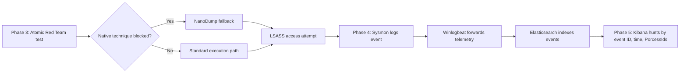

# Enterprise SOC & Threat Emulation Lab

This document serves as the formal operational baseline for the incident response and adversary emulation cycle executed within the Azure and ServiceNow environments.

## Phase 1: Security Operations & SLA Management (ServiceNow)

### Objective
Establish a strict ITIL-compliant triage protocol for incoming high-fidelity SIEM alerts to satisfy organizational Service Level Agreements (SLAs).

### How
- Alerts are ingested and triaged via the `incident.do` application.
- The priority matrix is calculated dynamically by setting Impact to 1 (High) and Urgency to 1 (High), forcing a 1-Critical classification.
- The incident is immediately claimed via the Assigned to field upon opening.
- Internal analysis is documented strictly within the Work Notes field.
- Upon containment, the state is transitioned to Resolved with an appropriate code, such as Workaround provided for containment or Solution provided for eradication.

### Why
- Assigning the ticket immediately stops the automated Response SLA timer, typically 15 minutes for Critical alerts. Failing to do so triggers management escalations.
- Using Work Notes keeps sensitive tactical data, such as IPs or compromised credentials, internal and hidden from the end user.

### Tradeoffs and Failure Modes
- Manual closure violation: analysts must never force a ticket state to Closed. This bypasses the 3-to-7-day automated validation window. If an adversary regains access, a closed ticket cannot be reopened, artificially inflating SOC volume metrics and damaging MTTR tracking.

## Phase 2: Cloud Infrastructure & FinOps (Azure)

### Objective
Maintain a highly available, budget-constrained infrastructure capable of supporting a SIEM node and a target endpoint without exhausting promotional cloud credits.

### How
- Deploy an Ubuntu Elastic SIEM node on Standard_D2s_v3 and a Windows victim endpoint on Standard_B2ls_v2.
- Deallocate virtual machines from the Azure Portal immediately after testing windows.

### Why
- Continuous operation of these SKUs creates a baseline compute burn rate of approximately $4.64 per day.
- A promotional budget, such as $200, treats infrastructure as a finite resource. Idle runtime drains capital with no operational return.

### Tradeoffs and Failure Modes
- The egress threat: leaving exposed infrastructure running unattended invites automated botnet scanning and brute-force attempts. Even if authentication holds, inbound and outbound traffic can generate large egress billing and accelerate credit exhaustion beyond static compute costs.

## Phase 3: Adversary Emulation & EDR Evasion (Atomic Red Team)

### Objective
Validate detection capabilities for MITRE ATT&CK T1003.001, OS Credential Dumping: LSASS Memory, using realistic evasion-capable tooling.

### How
- Deploy the Atomic Red Team execution framework via administrative PowerShell.
- Execute simulated attacks. When native mechanisms such as `Out-Minidump.ps1` are blocked by Windows Defender or AMSI, pivot to purpose-built evasion binaries like `nanodump.x64.exe`.

### Why
- Modern endpoint detection and response platforms place user-mode hooks on standard Windows APIs such as `MiniDumpWriteDump`.
- NanoDump bypasses those hooks by issuing direct system calls to the Windows kernel and deliberately corrupting the MDMP file signature on disk to evade real-time file scanning.

### Tradeoffs and Failure Modes
- Relying on compiled, well-known binaries such as `mimikatz.exe` tests basic antivirus signatures, not behavioral SIEM logic. True validation requires living-off-the-land binaries or direct syscall implementations that better emulate advanced persistent threats.

## Phase 4: Telemetry Generation & Pipeline Architecture (Sysmon and Winlogbeat)

### Objective
Generate high-fidelity process-level telemetry and route it reliably from the Windows endpoint to the Elasticsearch cluster.

### How
- Install Sysinternals Sysmon using the SwiftOnSecurity XML configuration template to trace advanced system behavior.
- Configure `winlogbeat.yml` to ingest standard event channels alongside `Microsoft-Windows-Sysmon/Operational`.

### Why
- Standard Windows Security auditing, such as Event ID 4673 or 4624, lacks the granular visibility required to track in-memory process manipulation. Sysmon injects a kernel driver to expose process creation, memory access, and file creation.

### Tradeoffs and Failure Modes
- The YAML parser trap: non-breaking spaces copied from web browsers into YAML configurations can cause silent failures in the Winlogbeat daemon.
- The service enumeration trap: if Winlogbeat starts before Sysmon is installed, it queries the Windows Registry, fails to find the Sysmon channel, and permanently drops it from its listening queue. The Winlogbeat service must be restarted after Sysmon installation to re-hook the new registry keys.

## Phase 5: Threat Hunting & Cryptographic Verification (Kibana)

### Objective
Positively identify malicious execution chains and filter background system noise using chronological and cryptographic deductions.

### How
- Query the SIEM for Sysmon Event IDs 1, 10, and 11 to rebuild the execution lineage, such as `cmd.exe` spawning `nanodump.x64.exe` targeting `lsass.exe`.
- Validate temporal proximity. Logs occurring minutes after artifact creation, such as a 26-minute delta for `SeTcbPrivilege` access, are discarded as unrelated system noise.

### Why
- Attackers routinely rename execution binaries, such as renaming `nanodump.exe` to `svchost.exe`, to blend in with normal system operations.

### Tradeoffs and Failure Modes
- Searching strictly by filename through `winlog.event_data.CommandLine` is fragile. To maintain positive control over an indicator of compromise, analysts should query immutable PE metadata, specifically `winlog.event_data.OriginalFileName`, or search by cryptographic signatures such as `hash.sha256`, which remain static regardless of disk-level renaming.

## End-to-End Workflow

