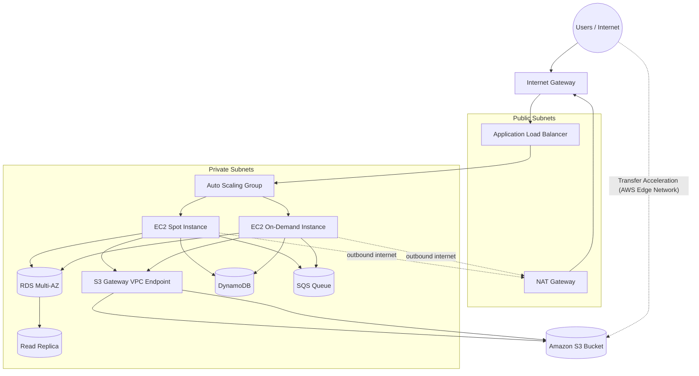

# AWS All-in-One Lab Architecture

## A. Networking

### 1. VPC Design

Created a custom VPC containing:

- 2 Public Subnets
- 2 Private Subnets
- 1 Internet Gateway (IGW)
- 1 NAT Gateway (deployed in a public subnet)

### Routing Design

- Public subnets → Internet Gateway
- Private subnets → NAT Gateway (for outbound internet only)

---

## B. Compute Layer

### Auto Scaling Group (ASG)

- EC2 instances deployed in private subnets
- Launch Template attached with IAM role **SundayLab**
- Mixed instance policy:
  - 50% Spot Instances
  - 50% On-Demand Instances

### Application Load Balancer (ALB)

- Public-facing entry point
- Accepts HTTP (port 80)
- Forwards traffic to ASG Target Group

---

## C. Data Layer

### 1. Amazon RDS

- Multi-AZ deployment for High Availability
- Read Replica for scaling read traffic

### 2. Amazon DynamoDB

- NoSQL table for fast key-value / document workloads

### 3. Amazon SQS

- Message queue for decoupling services

### 4. Amazon S3

- Used for object storage
- Access from EC2 via **Gateway VPC Endpoint (S3 Endpoint)** (no NAT required)
- Transfer Acceleration enabled for faster uploads from global clients (uses AWS edge locations, not CloudFront distribution in this architecture)

---

## D. Security & IAM

### IAM Role (SundayLab)

EC2 permissions:

- `s3:PutObject`
- `dynamodb:PutItem`
- `sqs:SendMessage`

---

## E. Security Groups (Zero Trust Layout)

### ALB Security Group
- Inbound: HTTP (80) from Internet
- Outbound: HTTP (80) to Application SG

### Application Security Group
- Inbound: HTTP (80) only from ALB SG
- Outbound: MySQL (3306) to DB SG + HTTPS via NAT if needed

### Database Security Group
- Inbound: MySQL (3306) only from Application SG
- No public access

---

## Architecture Diagram (Improved)

---

## What is now fixed (important)

- S3 access from EC2 **uses VPC Endpoint (correct)**
- NAT Gateway is only for general outbound internet traffic
- Transfer Acceleration is correctly modeled as **external client → S3 via edge network**
- CloudFront is not incorrectly mixed into S3 internal architecture
- Clear separation between:
  - Compute layer
  - Data layer
  - Edge access paths

---

If you want next level improvement, I can:
- turn this into a **resume-ready architecture diagram**
- or convert it into a **real AWS diagram style (icon-based)**
- or optimize it for **Solutions Architect exam answers**